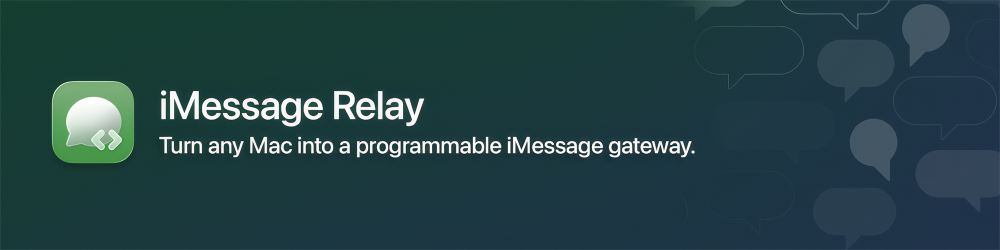

# iMessage Relay

> Turn any Mac into a programmable iMessage gateway. Read every incoming message in real time, send back from a **REST API**, **AI client over MCP**, or any HTTP client — over a **Cloudflare Tunnel** so it's reachable from anywhere.

[](./LICENSE)
[](./src)
[](./src/Package.swift)
[](#cloudflare-tunnel-two-modes)
[](#mcp-server--drive-it-with-an-ai)

Shipped as a native macOS menu bar app, code-signed and notarized, with Sparkle auto-updates. Pure SwiftPM, no Xcode required.

**Apple owns the delivery, the encryption, the device sync, the spam filtering. iMessage Relay owns everything you'd otherwise glue together** — an outbound event stream, a queryable REST API, an MCP surface for AI agents, attachment relay in both directions, and a Cloudflare Tunnel so all of it is reachable from your remote backend.

**Jump to:** [Quickstart](#quickstart) · [Install](#install) · [Your first relay](#your-first-relay) · [API](#api) · [Drive it with an AI](#mcp-server--drive-it-with-an-ai) · [Configuration](#configuration)

---

## Contents

- [Features](#features)
- [Quickstart](#quickstart)
- [Install](#install)
- [Your first relay](#your-first-relay)
- [Why iMessage Relay](#why-imessage-relay)
- [What makes iMessage Relay different](#what-makes-imessage-relay-different)
- [Architecture](#architecture)
- [API](#api)
- [Configuration](#configuration)
- [Permissions](#permissions)
- [Development](#development)
- [Releasing](#releasing)
- [Project layout](#project-layout)
- [Documentation](#documentation)
- [Credits](#credits)
- [License](#license)

## Features

| Feature | What you get | Deep dive |
|---|---|---|
| **Live event relay** | Watches `~/Library/Messages/chat.db` via IMsgCore's `MessageWatcher` and pushes `message.received`, `message.sent`, and `message.reaction` events to your HTTPS endpoint the moment they hit the database. Same envelope for tunnel lifecycle and relay lifecycle events. | [below](#real-time-event-relay) |
| **Crash-safe delivery queue** | SQLite WAL-backed retry queue with exponential backoff (capped at 60s) and dead-letter parking after configurable max attempts. No message loss across crashes, network outages, or tunnel reconnects. | [below](#crash-safe-delivery-queue) |
| **HTTP MCP through Cloudflare Tunnel** | The full MCP tool catalog (7 tools) reachable from anywhere as `POST /mcp` on the same tunnel hostname your event endpoint uses. Stateless transport — no SSE, no session juggling — just bearer auth and JSON. | [below](#mcp-server--drive-it-with-an-ai) |
| **Stdio MCP for Claude Desktop** | Same binary, run with `--mcp` exposes the same 7 tools over stdin/stdout. Drop-in config template in `examples/`. | [below](#mcp-server--drive-it-with-an-ai) |
| **Inbound + outbound attachments** | Inbound: every event with an attachment carries metadata + a tunnel URL the recipient backend can fetch the bytes from (with HEIC→JPEG transcode). Outbound: raw bytes via REST or base64 via MCP, both 100 MB. | [below](#both-directions-on-attachments) |
| **Cloudflare Tunnel, two modes** | **Free** `*.trycloudflare.com` for zero-setup demos. **Named** for a stable hostname AI clients can hardcode. The same connector token, supervised by the app, surfaced as `server.callback_url` on every event. | [below](#cloudflare-tunnel-two-modes) |
| **Contact name resolution** | Optional Contacts integration enriches every inbound event + history response with `sender_name` and `reply_to_sender_name` resolved from your Mac's address book. | [below](#contact-name-resolution) |
| **Native macOS UX** | Menu bar icon, SwiftUI settings window matching System Settings' grouped form style, friendly Full Disk Access prompt, Sparkle 2 auto-updates. | [docs/ARCHITECTURE.md](docs/ARCHITECTURE.md) |
| **Signed + notarized releases** | GitHub Actions builds arm64 + x86_64 DMG/ZIP artifacts with Developer ID signing, Apple notarization, EdDSA-signed Sparkle appcast — everything you need to ship to real users. | [docs/DISTRIBUTION.md](docs/DISTRIBUTION.md) |
| **Pure SwiftPM build** | One `make app` and you have a working bundle. No Xcode project, no `.xcworkspace`, no `pbxproj` to merge-conflict on. | [Development](#development) |

## Quickstart

Install the app (see [Install](#install) below), grant Full Disk Access, and verify the relay end-to-end with one curl through the auto-provisioned free tunnel:

```bash
# 1. Set Endpoint URL in Settings → General to https://webhook.site/<your-uuid> (or any HTTPS endpoint).
# 2. Toggle Settings → Network → Cloudflare Tunnel ON (Free mode).
# 3. Read the public URL from the menu bar and curl it:

export TUNNEL_URL="https://<your-random-subdomain>.trycloudflare.com"
export TOKEN="<your bearer token from Settings>"

curl -sS "$TUNNEL_URL/status" -H "Authorization: Bearer $TOKEN"
# {"identifier":"...","tunnel_url":"https://...","tunnel_running":true,...}

curl -sS "$TUNNEL_URL/chats?limit=3" -H "Authorization: Bearer $TOKEN"
# {"chats":[...]}
```

Send yourself a message from another device — it appears in the webhook receiver within ~1 second, and shows up on `curl /history?chat_id=<id>`. You've verified every layer (chat.db read, queue, tunnel, REST, MCP) without writing any code.

## Install

| Target | When to pick it | Walkthrough |
|---|---|---|
| **Signed release DMG** | Default for end users — code-signed, notarized, Sparkle auto-updates wired in. | [Releases](https://github.com/ranaroussi/imsg-relay/releases) |
| **From source** | You want to hack on it, or you fork the project. Requires Swift 6.0+ and macOS 14+. | [below](#from-source) |

### From a release

1. Download the right DMG for your Mac from [Releases](https://github.com/ranaroussi/imsg-relay/releases):
   - `imsg-relay-arm64.dmg` — Apple Silicon (M1/M2/M3/M4)
   - `imsg-relay-x86_64.dmg` — Intel
2. Mount the DMG and drag **iMessage Relay** to your **Applications** folder.
3. Launch it. The menu bar icon appears in the top-right.
4. On first launch you'll be prompted to grant **Full Disk Access** — required to read `chat.db`. Click *Open Privacy Settings*, drag the app into the list, flip the toggle on. The relay auto-resumes the moment macOS grants access (no need to click *Try Again*).
5. On your first outbound send you'll see a one-time **Automation → Messages** prompt — allow it.
6. (Optional) Grant **Contacts** if you want phone/email handles resolved to names on inbound events. See [Permissions](#permissions).

### From source

```bash
git clone https://github.com/ranaroussi/imsg-relay
cd imsg-relay
make app          # builds, code-signs (ad-hoc if no Developer ID), produces ./iMessage\ Relay.app
make install      # copies to /Applications/
open "/Applications/iMessage Relay.app"
```

Other targets:

```bash
make build        # debug binary at src/.build/debug/ImsgRelay
make release      # release binary at src/.build/release/ImsgRelay
make run          # build .app and launch
make clean        # nuke build artifacts and the .app bundle
make help         # list everything
```

The build pipeline is intentionally just `swift build` + a shell script — no Xcode project to merge-conflict on. See [`create-app-bundle.sh`](./create-app-bundle.sh) for the exact bundle assembly.

If `cloudflared` isn't bundled (dev builds without it in `Contents/Resources/`) the app falls back to `/opt/homebrew/bin/cloudflared`, `/usr/local/bin/cloudflared`, or `which cloudflared`. Install via Homebrew if you don't already have it:

```bash
brew install cloudflared
```

## Your first relay

The full arc — start the tunnel, point it at a webhook receiver, send yourself an iMessage, watch it arrive on your endpoint, then send one back via curl:

```bash
# 1. Open Settings… and set:
#      Identifier: personal
#      Endpoint URL: https://webhook.site/<your-uuid>
#      Bearer token: <any string>
#      Enable Cloudflare Tunnel: ON (Free mode for the demo)

# 2. Read the public tunnel URL from the menu bar and copy it:
export TUNNEL_URL="https://manufacture-array-foo-bar.trycloudflare.com"
export TOKEN="dev-token"

# 3. From your iPhone, send yourself an iMessage. It POSTs to your endpoint
#    within ~1 second as:
#
#    {
#      "type": "message.received",
#      "timestamp": "2026-06-09T13:00:00Z",
#      "data": { "id": 19592, "sender": "+1...", "text": "Hi", ... },
#      "server": {
#        "identifier": "personal",
#        "endpoint": "https://webhook.site/...",
#        "callback_url": "https://manufacture-array-foo-bar.trycloudflare.com"
#      }
#    }

# 4. Reply from your backend:
curl -X POST "$TUNNEL_URL/send" \
  -H "Authorization: Bearer $TOKEN" \
  -H 'Content-Type: application/json' \
  -d '{"to":"+14155550123","text":"Reply from the relay"}'
# {"queued":true}

# 5. Send an attachment back:
curl -X POST "$TUNNEL_URL/send/attachment?to=%2B14155550123&filename=photo.jpg" \
  -H "Authorization: Bearer $TOKEN" \
  -H 'Content-Type: image/jpeg' \
  --data-binary @photo.jpg
# {"queued":true,"bytes":12345,"filename":"photo.jpg"}
```

`POST /send` and `POST /send/attachment` both drive Messages.app via AppleScript, so the messages go out from the same iCloud account you're signed into on the Mac. Add `chat_id` instead of `to` to target an existing group chat. Outbound MCP works exactly the same — call the `imsg_send_message` or `imsg_send_attachment` tool with the same parameters.

## Why iMessage Relay

Apple is excellent at delivering iMessages: end-to-end encryption, multi-device sync, spam filtering, the whole stack. It is also entirely uninterested in letting your backend read or write those messages in any first-class way — there's no API, no webhook, no server SDK. Your options have historically been: build something brittle around AppleScript on a dev's laptop, or pay for an iMessage-as-a-Service provider that proxies your traffic through their cloud.

iMessage Relay is the third option: **a thin native app that turns the Mac you already own into a programmable gateway**, talking to Apple's stack directly and exposing the parts you actually want over HTTP/MCP.

**Apple keeps owning what it's good at:** delivery, end-to-end encryption, multi-device sync, deliverability, spam protection.

**iMessage Relay owns the parts you'd otherwise glue together by hand:**

- **A live event stream** of incoming messages, sent messages, and reactions — pushed to your HTTPS endpoint with a durable retry queue so you don't lose anything across crashes or network outages.
- **A queryable REST API** for the history, the chats, attachment bytes, and full-text search across your message database — same `chat.db` Messages.app reads from.
- **An MCP server** with seven tools, exposed both over stdio (for local Claude Desktop) and over HTTP through a Cloudflare Tunnel (for any remote AI agent that speaks MCP). Same tool catalog, two transports.
- **A Cloudflare Tunnel supervisor** built in, with two modes (free `*.trycloudflare.com` or your own stable domain) so your backend can reach the relay from anywhere — no port forwarding, no VPN, no public IP. Every event payload includes the live tunnel URL.
- **Attachments in both directions.** Inbound events carry attachment metadata + a tunnel URL you can fetch the bytes from on demand (with HEIC→JPEG transcode for compatibility); outbound `POST /send/attachment` accepts raw bytes for any file type.
- **Contact name resolution.** Optional Contacts framework integration enriches every event with `sender_name` resolved from your Mac's address book.

The philosophy:

> Keep the Mac as a dumb edge node. Apple does the messaging, the relay does the plumbing, your backend does the business logic.

## What makes iMessage Relay different

### Real-time event relay

Every iMessage event becomes an HTTP POST to your endpoint, as soon as it's written to `chat.db`:

```json
{
  "type": "message.received",
  "timestamp": "2026-06-09T13:00:00.482Z",
  "data": {
    "id": 19592,
    "guid": "11FD445C-...",
    "sender": "+14155550123",
    "sender_name": "Jane Doe",
    "text": "Hi",
    "chat_id": 2035,
    "service": "iMessage",
    "is_from_me": false,
    "attachments_count": 0
  },
  "server": {
    "identifier": "sales",
    "endpoint": "https://your-server.example.com/imessage",
    "callback_url": "https://imsg.yourcompany.com"
  }
}
```

`server.callback_url` is read live from `TunnelManager` so URL rotations propagate immediately — handy when you're on the rotating `*.trycloudflare.com` URL.

Event types (defined in `Sources/Relay/EventEnvelope.swift`):

- `message.received` / `message.sent` / `message.reaction` — message lifecycle
- `tunnel.connected` / `tunnel.disconnected` / `tunnel.changed` — Cloudflare Tunnel transitions
- `relay.started` / `relay.stopped` — relay lifecycle

Your endpoint responds `2xx` to confirm delivery. `5xx` and `429` trigger a backoff-and-retry; other `4xx` codes park the event as `dead`.

### Crash-safe delivery queue

The relay never holds inbound state in memory — every event lands in a SQLite WAL queue before the HTTP POST even fires. If your endpoint is down, the network is flaky, the tunnel is reconnecting, or the Mac falls asleep mid-send, the event is safe on disk:

- Each delivery attempt waits `min(60, 2^n) + jitter` seconds.
- After configurable `Max retry attempts` (default `12`) the event is parked as `dead` and never retried again — visible in the menu bar's queue stats with a one-click "Clear dead events" action.
- On boot, the queue resumes from wherever it left off.
- A `chat.db` watch cursor is persisted on every successful flush, so message backfill on restart is opt-in (off by default — see Settings → General → *Backfill missed messages on restart*).

The queue is exposed as `GET /stats` (`{"pending": N, "dead": M}`) for monitoring, and the watcher is paused/resumed by the same `TunnelStatus` observable that drives the menu bar's UI.

### Both directions on attachments

**Inbound.** Every event whose underlying message has attachments carries a structured `attachments` array next to the existing `attachments_count`:

```json
{
  "type": "message.received",
  "data": {
    "id": 19592,
    "attachments_count": 1,
    "attachments": [{
      "url":              "https://imsg.yourcompany.com/attachments/19592/0",
      "url_path":         "/attachments/19592/0",
      "filename":         "IMG_1234.HEIC",
      "mime_type":        "image/heic",
      "served_mime_type": "image/jpeg",
      "uti":              "public.heic",
      "size":             1846291,
      "is_sticker":       false,
      "missing":          false
    }]
  }
}
```

`url` is the absolute URL through the tunnel (present only when the tunnel is up), `url_path` is always present so you can concatenate with `server.callback_url` if you'd rather. `served_mime_type` reflects on-the-fly HEIC→JPEG transcoding so the bytes you actually fetch are usable by anything that can decode JPEG. `missing: true` means `chat.db` references a file that's been pruned by macOS — the fetch URL will 404.

**Outbound (REST).** `POST /send/attachment?to=&filename=&text=` takes the raw bytes in the body — no multipart, no base64, just bytes. 100 MB cap.

```bash
curl -X POST "$TUNNEL_URL/send/attachment?to=%2B14155550123&filename=photo.jpg&text=Caption" \
  -H "Authorization: Bearer $TOKEN" \
  -H 'Content-Type: image/jpeg' \
  --data-binary @photo.jpg
```

Files are staged into `~/Library/Application Support/imsg-relay/outbound/<uuid8>-<filename>`, handed to Messages.app, and cleaned up in a `defer` the moment the AppleScript send returns — success or error.

**Outbound (MCP).** `imsg_send_attachment` accepts the same `to`/`filename`/`text`/`chat_id` plus a `content_base64` field, since JSON-RPC has no separate body. Or pass `attachment_path` if you're calling over stdio MCP on the same Mac and would rather skip the encoding overhead.

### MCP server — drive it with an AI

iMessage Relay speaks MCP over two transports — same tool surface either way. **HTTP is the primary path** (because it works from any AI agent in any datacenter); stdio is preserved for local Claude Desktop.

**HTTP through the tunnel.** The menu bar app boots an MCP server on the official [`modelcontextprotocol/swift-sdk`](https://github.com/modelcontextprotocol/swift-sdk)'s `StatelessHTTPServerTransport` and exposes it at `POST /mcp` — same Hummingbird server that serves the REST API, same bearer-token auth, same tunnel hostname.

```bash
curl -sS -X POST "$TUNNEL_URL/mcp" \
  -H 'Content-Type: application/json' \
  -H 'Accept: application/json' \
  -H "Authorization: Bearer $TOKEN" \
  -d '{
    "jsonrpc": "2.0",
    "id": 1,
    "method": "tools/call",
    "params": {
      "name": "imsg_list_chats",
      "arguments": {"limit": 10}
    }
  }'
```

No SSE, no session header to manage — just bearer auth and a JSON body per request.

**Stdio for Claude Desktop.** Wire it into `~/Library/Application Support/Claude/claude_desktop_config.json` (a copy-pasteable template lives in [`examples/claude_desktop_config.json`](examples/claude_desktop_config.json)):

```json
{
  "mcpServers": {
    "imsg-relay": {
      "command": "/Applications/iMessage Relay.app/Contents/MacOS/ImsgRelay",
      "args": ["--mcp"]
    }
  }
}
```

> **FDA gotcha:** when Claude Desktop spawns the stdio binary, it's *Claude Desktop's* TCC profile that's evaluated against `chat.db`, not the menu bar app's. Add **Claude Desktop.app** itself to System Settings → Privacy & Security → Full Disk Access. The menu bar app's FDA grant does not transfer. The HTTP transport doesn't have this problem.

**Tools exposed (both transports):**

| Tool | Purpose |
|------|---------|
| `imsg_list_chats` | Recent chats, paged |
| `imsg_get_chat` | Chat info + participants by id |
| `imsg_get_history` | Messages for a chat |
| `imsg_search_messages` | Full-text search |
| `imsg_send_message` | Text send |
| `imsg_send_attachment` | File send (base64 or path) |
| `imsg_get_status` | Config + tunnel state |

Then ask your model in plain English:

> *"Who messaged me today, and what was the last thing Jane said? Reply to her with 'on my way'."*

### Cloudflare Tunnel, two modes

iMessage Relay can front the local API + MCP with the Cloudflare edge in two ways. Pick whichever fits your remote endpoint architecture.

| | **Free** (`trycloudflare.com`) | **Named** (custom domain) |
|---|---|---|
| **Underlying command** | `cloudflared tunnel --url http://localhost:<port>` | `cloudflared tunnel --no-autoupdate run --token <token>` |
| **URL** | Random `*.trycloudflare.com`, **rotates every restart** | Stable hostname you own (e.g. `imsg.yourcompany.com`) |
| **CF account required** | No | Yes (any plan, including free) |
| **Setup time** | Zero | ~3 minutes in the dashboard |
| **Best for** | First-launch demos, backends that read `server.callback_url` out of every event | AI clients that hardcode the server URL; any consumer that can't refresh its config dynamically |
| **DNS** | CF assigns | You point a CNAME in your zone at the tunnel (CF auto-creates it from the dashboard) |
| **CF Access policies** | Not available | mTLS, IP allowlists, OAuth/IdP gates — sit in front of the tunnel hostname |

Both modes emit the same `tunnel.connected` / `tunnel.disconnected` / `tunnel.changed` events. The `server.callback_url` on every event always reflects the current public URL.

The full named-tunnel walkthrough (dashboard steps, DNS setup, the credential-split rationale, verification curl recipes) lives further down in this README under [Setting up a named tunnel](#setting-up-a-named-tunnel).

### Contact name resolution

When you grant **Contacts** access (Settings → General → Contacts → *Grant Access*), inbound message and reaction events carry an additional `data.sender_name` (and `data.reply_to_sender_name` for replies) resolved from your Mac's Contacts:

```json
{
  "type": "message.received",
  "data": {
    "sender": "+14155550123",
    "sender_name": "Jane Doe",
    "reply_to_sender": "ran@aroussi.com",
    "reply_to_sender_name": "Ran Aroussi",
    ...
  }
}
```

The same enrichment appears on `GET /history` and `GET /search/messages`, so the `imsg_get_history` and `imsg_search_messages` MCP tools surface contact names too. The resolver caches lookups in-memory; editing a contact card invalidates the cache automatically via `CNContactStoreDidChange`. Without the grant, the events look identical except those two fields are absent — treat them as best-effort enrichment, not a contract.

> **Why the prompt is gated behind a button instead of auto-prompting on launch:** the relay is an `LSUIElement` (menu bar) app, and TCC refuses to display permission dialogs to apps without foreground activation. Auto-requesting on boot would silently deny and cache that deny forever. The Settings button activates the app first so the prompt shows up correctly.

## Architecture

```
       Messages.app                    Your backend / your AI agent
             │                                    ▲
             ▼                                    │
   ~/Library/Messages/chat.db                     │  POST events / REST / MCP
             │ (read + watch)                     │  (HTTPS, bearer-auth)
             ▼                                    │
┌────────────────────────────────────────────┐    │
│         iMessage Relay.app                 │    │
│                                            │    │
│  AppDelegate ─┬─ ImsgClient (actor)        │    │
│               │     └─ IMsgCore: Store,    │    │
│               │        Watcher, Sender     │    │
│               │                            │    │
│               ├─ RelayQueue (SQLite WAL)   │    │
│               │     cursor + retry table   │    │
│               │                            │    │
│               ├─ HTTPRelay (actor) ─────────────┘  outbound POST
│               │     exp backoff, dead-letter
│               │
│               ├─ LocalAPIServer (Hummingbird)
│               │     /health, /chats, /history,
│               │     /search, /send, /send/attachment,
│               │     /attachments/:id/:i, /mcp
│               │
│               ├─ TunnelManager
│               │     supervises cloudflared,
│               │     parses public URL
│               │
│               ├─ ContactsResolver
│               │     CNContactStore + cache
│               │
│               └─ MCPService
│                    stdio (--mcp) or HTTP transport
└────────────────────────────────────────────┘
                       │
                       ▼
                 Cloudflare Tunnel
                       │
                       ▼
           Local HTTP API (Hummingbird)
           exposed via *.trycloudflare.com
           or your own named hostname
```

One Swift binary, two process modes. The menu-bar default brings everything up; `--mcp` reuses the same `ImsgClient` actor as a bare-bones stdio MCP server with no GUI surface.

The relay is intentionally a "dumb edge node": no business logic, no analytics, no AI, no multi-tenancy. All that belongs on your backend.

Full deep-dive (concurrency model, actor isolation, lifecycle, IMsgCore wrapping rationale) in [docs/ARCHITECTURE.md](docs/ARCHITECTURE.md).

## API

The local HTTP server speaks JSON over HTTP on the configured port (default `7878`). When **Bearer token** is set in Settings, every route except `/health` requires `Authorization: Bearer <token>`. When the tunnel is enabled, the same routes are reachable through the public URL with the same token.

| Method | Path | Purpose |
|--------|------|---------|
| `GET`  | `/health` | Liveness probe — returns `{"ok": true}` |
| `GET`  | `/status` | Identifier + endpoint + tunnel state |
| `GET`  | `/stats`  | Queue depth (`{"pending": N, "dead": M}`) |
| `GET`  | `/chats?limit=N` | Recent chats, most-recent first |
| `GET`  | `/chats/:id` | One chat by numeric id (includes participants) |
| `GET`  | `/history?chat_id=N&limit=N` | Recent messages for a chat |
| `GET`  | `/search/messages?q=foo&match=contains&limit=N` | Full-text search across chat.db |
| `GET`  | `/attachments/:message_id/:index` | Fetch attachment bytes by message rowid + zero-based index |
| `POST` | `/send` | Send a text message |
| `POST` | `/send/attachment` | Send a file attachment (raw bytes in body, metadata in query string) |
| `POST` | `/mcp`  | MCP JSON-RPC endpoint (see [MCP](#mcp-server--drive-it-with-an-ai)) |

`POST /send` body:

```json
{
  "to": "+14155550123",
  "text": "Hello",
  "service": "auto"
}
```

Pass `chat_id` instead of `to` to send into an existing group. `service` can be `auto`, `imessage`, or `sms`.

`POST /send/attachment` parameters:

| Param | Required | Notes |
|-------|----------|-------|
| `to`        | yes (or use `chat_id`) | Phone number (E.164) or email |
| `filename`  | yes | Final filename Messages.app sees. URL-encode any spaces (`%20`). Sanitized to a basename, with `[^A-Za-z0-9.-_()[]+ ]` replaced by `_`. |
| `text`      | no  | Optional caption sent with the attachment. URL-encode (`%20` for spaces). |
| `chat_id`   | no  | Numeric chat id from `/chats`. |
| `service`   | no  | `auto` (default), `imessage`, or `sms`. |

The body is capped at **100 MB**. Beyond that the request is rejected with `400 Bad Request`.

The `/attachments/:id/:index` route returns the file bytes with `Content-Type` from `served_mime_type` (or the original `mime_type`) and a `Content-Disposition: inline; filename="..."` header so `curl -OJ` and browsers behave nicely.

## Configuration

Click the menu bar icon → **Settings…** and fill in:

| Tab | Field | Default | Purpose |
|-----|-------|---------|---------|
| General | **Identifier** | `relay` | Stable string sent as `server.identifier` on every event. Example: `sales`, `support`, `personal`. |
| General | **Endpoint URL** | (empty) | HTTPS endpoint that receives relayed events. Events queue up while empty — they drain the moment you save a URL. |
| General | **Bearer token** | (empty) | Sent as `Authorization: Bearer <token>` on outbound POSTs *and* required on the local HTTP API when set. Leave blank for dev. |
| General | **Include reactions (tapbacks)** | on | When off, reactions are dropped at the watcher and never enter the queue. |
| General | **Backfill missed messages on restart** | off | When on, messages received while iMessage Relay was offline get relayed once it restarts. Off by default so a long quit period doesn't dump multi-day history at once. |
| General | **Contacts access** | not requested | Click *Grant Access* to enable `sender_name` enrichment. See [Permissions](#permissions). |
| Network | **Local API port** | `7878` | Where the Hummingbird server listens. Must match the tunnel's Public Hostname target. |
| Network | **MCP port** | `7879` | Reserved for a future dedicated MCP transport; currently unused (MCP is served on the same port as REST). |
| Network | **Enable Cloudflare Tunnel** | off | Spawns `cloudflared` and reveals the live public URL inline with a copy button. |
| Network | **Tunnel mode** | Free | `Free (trycloudflare.com)` (ephemeral URL) or `Named (your own domain)` (stable hostname). See [Tunnel modes](#cloudflare-tunnel-two-modes). |
| Network | **Tunnel token** | (empty) | (Named mode only) Cloudflare connector token from the Zero Trust dashboard. Stored as a secret. |
| Network | **Public hostname** | (empty) | (Named mode only) The DNS name your tunnel routes from, e.g. `imsg.yourcompany.com` — bare host, no scheme. |
| Network | **Max retry attempts** | `12` | Each attempt waits `min(60, 2^n) + jitter` seconds. After this many failures an event is parked as `dead`. |

Click **Save**, you'll see a green ✓ Saved confirmation. Most fields hot-reload; tunnel-relevant changes trigger a smart restart (only stops + starts the tunnel if something tunnel-related actually changed).

### Setting up a named tunnel

iMessage Relay does **not** create the tunnel or DNS records on Cloudflare for you — the connector token you'll paste into the app is a low-privilege "worker badge" that only authorizes `cloudflared` to serve traffic, not to modify your account. You'll do three things in the Cloudflare dashboard (~3 minutes total), then two things in iMessage Relay.

> **Why can't the app do all of this from just the token?**
>
> The connector token is intentionally scoped to "register as a worker for this tunnel" — it can't create DNS records, can't change which hostname routes to which tunnel, can't read your zone list. Those authorities live on a different credential type (an API token or `cert.pem` from `cloudflared tunnel login`). CF designed it this way so you can deploy connectors to many machines without giving any of them the ability to reconfigure your network.

**Prerequisite checklist:**

- [ ] A domain on Cloudflare (any plan, including free). If you don't have one yet: CF dashboard → Add a site → switch your registrar's nameservers to the two CF gives you → wait for the zone to go active. Verify with `dig +short NS yourcompany.com` returning `*.ns.cloudflare.com`.
- [ ] iMessage Relay open with the Settings window ready.

---

**Step 1 — Create the tunnel object**

[Zero Trust dashboard](https://one.dash.cloudflare.com/) → **Networks → Tunnels** → **Create a tunnel** → pick **Cloudflared** → name it (e.g. `imsg-relay-my-mac`) → **Save tunnel**.

**Step 2 — Copy the connector token**

The next page is titled *"Install and run a connector."* **Ignore the install command** — just look at the bottom for the long token string starting with `eyJh…`. Copy that. iMessage Relay has its own bundled `cloudflared`, so you don't need to install anything from this page.

Click **Next**.

**Step 3 — Add a Public Hostname ← THIS IS WHERE DNS GETS CREATED**

This step gets missed more often than any other and is the difference between *"tunnel connects but the URL returns nothing"* and *"tunnel works."* Don't skip it.

You're now on the **Route traffic** page (also reachable later via Tunnels → your tunnel → **Public Hostnames** tab).

1. **Add a public hostname**
2. Fill in:
   - **Subdomain:** the prefix you want, e.g. `imsg` or `mcp`. Doesn't have to exist in DNS — CF will create the record.
   - **Domain:** pick your CF-managed domain from the dropdown
   - **Path:** *leave empty*
   - **Service type:** `HTTP`
   - **URL:** `localhost:7878` (must match Settings → Network → **Local API port**)
3. **Save hostname**

When you save, two things happen on Cloudflare's side: the tunnel's ingress gains a routing rule, and a proxied CNAME is created in your zone pointing `imsg.yourcompany.com → <tunnel-uuid>.cfargotunnel.com`. Verify with `dig +short imsg.yourcompany.com`.

*Gotcha:* if a conflicting `A`/`AAAA`/`CNAME` record for that exact hostname already exists, CF refuses the auto-create. Delete the conflicting record in DNS → Records, then re-save the Public Hostname.

---

**Step 4 — Paste credentials**

In iMessage Relay → Settings → Network → Cloudflare Tunnel:

1. ✅ Enable tunnel
2. **Mode:** Named (your own domain)
3. **Tunnel token:** paste the `eyJh…` string from step 2
4. **Public hostname:** the full hostname from step 3, e.g. `imsg.yourcompany.com` (bare host, no `https://`)
5. **Save**

**Step 5 — Verify**

The tunnel stops + restarts automatically when you save. Within ~5 seconds the **Public URL** row in Settings → Network should show `https://imsg.yourcompany.com`.

```bash
# DNS resolves (created in step 3)
dig +short imsg.yourcompany.com
# Expected: <tunnel-uuid>.cfargotunnel.com.

# Tunnel is routing
curl -sS https://imsg.yourcompany.com/health
# Expected: {"ok": true}

# Bearer auth works through the tunnel
curl -sS -H "Authorization: Bearer $TOKEN" https://imsg.yourcompany.com/status | jq
# Expected: {"identifier":"...","tunnel_url":"https://imsg.yourcompany.com",...}
```

If `dig` returns nothing, you skipped or misconfigured step 3 — go back to the Public Hostnames tab in the CF dashboard. The full debug recipe lives in [docs/TROUBLESHOOTING.md](docs/TROUBLESHOOTING.md#named-tunnel-wont-connect).

A single named tunnel can route multiple hostnames to different local ports — useful if you run other services alongside iMessage Relay. Add more Public Hostnames entries pointing at different `localhost:<port>` targets. iMessage Relay itself only cares about the hostname mapped to its API port.

## Permissions

iMessage Relay needs up to three system grants. All three prompts come from macOS itself.

| Permission | Required | Why | When you'll be asked |
|------------|----------|-----|----------------------|
| **Full Disk Access** | yes | Read `~/Library/Messages/chat.db` | First launch — friendly retry-able prompt, auto-resumes once granted |
| **Automation → Messages** | yes (for sends) | Drive Messages.app to send | On your first outbound send |
| **Contacts** | optional | Resolve handles to names on events + history | Settings → General → Contacts → *Grant Access* (does not auto-prompt; see [Contact name resolution](#contact-name-resolution) for why) |

The app sits idle, no events queued, until Full Disk Access is granted. Once granted it picks up where it left off.

## Development

```bash
make build      # debug binary
make release    # release binary
make app        # .app bundle (ad-hoc signed if no Developer ID is on the machine)
make run        # build + launch
make clean      # remove .build and the .app
make help       # list every target
make icon       # regenerate AppIcon.icns from assets/Icon-macOS-Default-1024x1024@2x.png
```

The build pipeline is `swift build` plus [`create-app-bundle.sh`](./create-app-bundle.sh) — no Xcode project, no `.xcworkspace`. The `make app` target produces a working bundle in ~10 seconds.

End-to-end manual QA playbook lives in [TESTING.md](TESTING.md): REST recipes, MCP recipes (stdio + HTTP), tunnel verification, permission flows, crash/restart resilience.

## Releasing

Full step-by-step lives in [`docs/DISTRIBUTION.md`](docs/DISTRIBUTION.md). The short version, once you've done the one-time maintainer setup (Apple Developer ID + Sparkle keypair):

```bash
git tag v0.2.0
git push origin v0.2.0
```

The `.github/workflows/release.yml` workflow then:

1. Builds arm64 + x86_64 in matrix.
2. Downloads the right `cloudflared` per arch and embeds it.
3. Code-signs with Developer ID (cert from `APPLE_DEVELOPER_CERTIFICATE_P12_BASE64` secret).
4. Injects `SUPublicEDKey` into Info.plist from `SPARKLE_ED_PUBLIC_KEY` secret.
5. Notarizes via `notarytool`, staples the ticket.
6. Packages DMG (`create-dmg`) + ZIP, both with SHA-256 checksums.
7. Cuts a GitHub Release with auto-generated notes.
8. Signs the release ZIP with `SPARKLE_ED_PRIVATE_KEY` via Sparkle's `sign_update`, prepends a new entry to `appcast.xml`, and commits it back to `main` — existing installs see the new version on their next daily poll.

Required GitHub secrets:

| Secret | Source |
|--------|--------|
| `APPLE_DEVELOPER_CERTIFICATE_P12_BASE64` | base64 of the exported Developer ID Application .p12 |
| `APPLE_DEVELOPER_CERTIFICATE_PASSWORD`   | password used during export |
| `APPLE_DEVELOPER_ID_APPLICATION`         | full identity string from `security find-identity` |
| `APPLE_ID`                               | your Apple ID email |
| `APPLE_TEAM_ID`                          | 10-character team ID |
| `APPLE_APP_SPECIFIC_PASSWORD`            | from appleid.apple.com → App-Specific Passwords |
| `SPARKLE_ED_PUBLIC_KEY`                  | output of `./scripts/sparkle-keygen.sh` (also paste into Info.plist) |
| `SPARKLE_ED_PRIVATE_KEY`                 | other output of `./scripts/sparkle-keygen.sh` (NEVER commit) |

See [docs/DISTRIBUTION.md](docs/DISTRIBUTION.md) for how to obtain each one and verify a published release.

## Project layout

```
.
├── README.md
├── LICENSE
├── CHANGELOG.md
├── TESTING.md
├── Makefile
├── create-app-bundle.sh             # SwiftPM build → .app skeleton → sign
├── entitlements.plist
├── sparkle-entitlements.plist
├── appcast.xml                      # Sparkle update feed (auto-updated on release)
├── docs/
│   ├── ARCHITECTURE.md              # concurrency, lifecycle, dependency rationale
│   ├── TROUBLESHOOTING.md           # common issues + recovery
│   └── DISTRIBUTION.md              # Apple Developer ID + Sparkle setup
├── examples/
│   └── claude_desktop_config.json   # drop-in MCP config for Claude Desktop
├── scripts/
│   ├── sparkle-keygen.sh            # one-time Sparkle ED25519 keypair generator
│   └── appcast-add.sh               # CI script: EdDSA-sign + append <item> to appcast.xml
├── .github/workflows/release.yml    # build matrix → notarize → DMG → release → appcast
├── assets/                          # design source files (banner, icon source PNG)
└── src/                             # the macOS app
    ├── Info.plist
    ├── Package.swift                # Swift 6, macOS 14+
    └── Sources/
        ├── main.swift               # --mcp branch + NSApplicationMain
        ├── AppDelegate.swift        # menu bar, runtime wiring, permission prompt
        ├── AppConfig.swift          # UserDefaults-backed config store
        ├── Permissions.swift        # FDA probe + System Settings deep link
        ├── Log.swift                # os.Logger categories
        ├── Imsg/ImsgClient.swift    # actor wrapping IMsgCore
        ├── Contacts/ContactsResolver.swift  # CNContactStore wrapper + cache
        ├── Relay/                   # EventEnvelope, RelayQueue (SQLite), HTTPRelay
        ├── Tunnel/                  # TunnelManager + TunnelStatus (observable)
        ├── API/LocalAPIServer.swift # Hummingbird routes + bearer auth
        ├── MCP/MCPServer.swift      # MCP service (stdio + HTTP)
        ├── Settings/SettingsView.swift  # SwiftUI Settings window
        └── Resources/               # AppIcon.icns, MenuBarIcon{,@2x,@3x}.png
```

## Documentation

- [`TESTING.md`](TESTING.md) — manual QA playbook for every surface (REST, MCP stdio, MCP HTTP, tunnel, permissions, settings UX, attachment recipes)
- [`CHANGELOG.md`](CHANGELOG.md) — version history
- [`docs/ARCHITECTURE.md`](docs/ARCHITECTURE.md) — technical deep-dive: concurrency model, process modes, lifecycle, data flow, dependency rationale
- [`docs/TROUBLESHOOTING.md`](docs/TROUBLESHOOTING.md) — common issues and recovery steps
- [`docs/DISTRIBUTION.md`](docs/DISTRIBUTION.md) — one-time maintainer setup for code signing, notarization, and Sparkle auto-updates

## Credits

- [`openclaw/imsg`](https://github.com/openclaw/imsg) — the heavy lifting (chat.db reads, watcher, AppleScript send surface) via its `IMsgCore` SwiftPM library
- [Sparkle](https://sparkle-project.org/) — auto-updates
- [Hummingbird](https://github.com/hummingbird-project/hummingbird) — the local HTTP server
- [`modelcontextprotocol/swift-sdk`](https://github.com/modelcontextprotocol/swift-sdk) — MCP
- [SQLite.swift](https://github.com/stephencelis/SQLite.swift) — the queue & cursor store
- [`cloudflared`](https://github.com/cloudflare/cloudflared) — public URL exposure

## License

[MIT](./LICENSE) © 2026 Ran Aroussi
